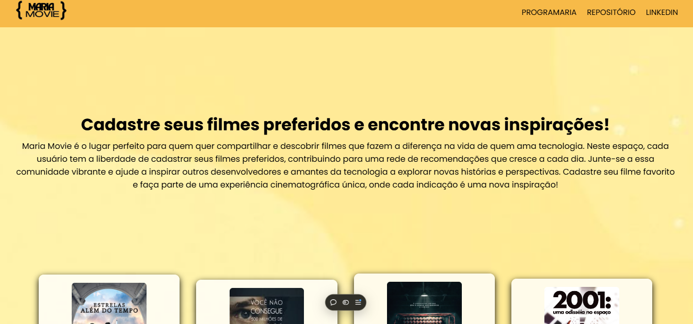

# 🎬 Projeto Maria Movie
- Maria Movie é uma plataforma criada para que desenvolvedores e entusiastas da tecnologia possam compartilhar e descobrir filmes inspiradores. Este projeto tem como objetivo promover uma rede colaborativa onde cada recomendação de filme pode ser uma nova fonte de ideias e inspirações para a comunidade.

# 📝 Descrição do Projeto
- O Maria Movie permite aos usuários cadastrar, visualizar, atualizar e deletar filmes que acham relevantes para quem vive o universo tech. Através de uma API construída em Node.js com Express e MongoDB, o projeto oferece uma experiência colaborativa para a criação de uma biblioteca de filmes recomendados.

# 🚀 Tecnologias Utilizadas
* Node.js: Plataforma para o desenvolvimento do back-end.
* Express: Framework para criar e gerenciar rotas e requisições HTTP.
* MongoDB: Banco de dados NoSQL usado para armazenar as informações dos filmes.
* Cors: Middleware para configurar a segurança e permitir o compartilhamento de recursos entre o front-end e o back-end.
# 📌 Funcionalidades
* Listar Filmes (GET /filme): Exibe todos os filmes cadastrados no banco de dados.
* Cadastrar Novo Filme (POST /filme): Permite adicionar um novo filme com informações como nome, imagem, autor, sinopse e ano.
* Atualizar Filme (PATCH /filme/:id): Permite editar os dados de um filme específico.
* Deletar Filme (DELETE /filme/:id): Exclui um filme pelo ID.
# 📂 Estrutura do Projeto
- filme.js: Arquivo principal que configura o servidor, conecta ao banco de dados e define as rotas da API.
- filmeModel.js: Arquivo que define o schema e o modelo de dados do MongoDB para o armazenamento dos filmes.
- bancoDeDados.js: Arquivo para a conexão com o MongoDB.
- Footer.jsx, Content.jsx: Componentes do front-end (não detalhados neste repositório, mas fazem parte do projeto visual).
# 🛠️ Instalação e Uso
- Clone o Repositório:

git clone https://github.com/evicsss/maria-movie.git

cd maria-movie

- Instale as Dependências:

npm install

- Configure o Banco de Dados:

Crie um banco no MongoDB e adicione sua URL de conexão no arquivo bancoDeDados.js.

## Inicie o Servidor:

node filme.js

O servidor será executado na porta 3333.

## Testar a API:

Utilize ferramentas como Postman ou Insomnia para fazer requisições e testar as rotas disponíveis.

# 📈 Futuras Melhorias
- Implementação de autenticação para cadastro e login de usuários.
- Interface de front-end mais robusta para facilitar o uso.
- Sistema de avaliações para que usuários possam avaliar os filmes cadastrados.
- Filtro de filmes por gênero, autor ou ano.

### 💡 Contribuição
Contribuições são bem-vindas! Sinta-se à vontade para fazer um fork do projeto, abrir issues e enviar pull requests. Toda ajuda é importante para tornar o Maria Movie ainda melhor!

### 📄 Licença
Este projeto está licenciado sob a MIT License. Veja o arquivo LICENSE para mais detalhes.